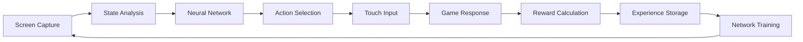

# 🚇 Subway Surfers AI Agent

<div align="center">


**🏄‍♂️ "Jake's autopilot on digital steroids" 🤖**

*An autonomous AI agent that masters Subway Surfers using Deep Q-Network reinforcement learning*

</div>

---

## 🎯 What is this?

This project creates an **intelligent AI agent** that learns to play Subway Surfers autonomously on BlueStacks Android emulator. Using computer vision and deep reinforcement learning, the agent:

- 👁️ **Sees** the game through screen capture and pixel analysis
- 🧠 **Thinks** using a neural network trained with Double-DQN algorithm  
- 🎮 **Acts** by sending touch gestures to control Jake's movements
- 📈 **Learns** from experience to achieve higher scores over time

```
🚂   🚂   🚂   🚂   🚂     ← Trains ahead
🏃  ░    ░    ░    ░      ← AI-controlled Jake
🪙   🚧   🪙   🚧   🪙     ← Coins & Barriers
```

---

## ✨ Features

### 🎮 **Autonomous Gameplay**
- Fully automated Subway Surfers gameplay
- Real-time decision making at 30-60 FPS
- Automatic game restart after death
- No human intervention required

### 🧠 **Advanced AI**
- **Deep Q-Network (DQN)** with experience replay
- **Double-DQN** architecture for stable learning
- **ε-greedy exploration** with decay (100% → 5%)
- **100,000 experience replay buffer**
- **Target network** updates every 1,000 steps

### 👁️ **Computer Vision**
- Real-time screen capture via ADB
- **5×3 grid analysis** of game state
- Pixel-based object detection (trains, coins, barriers)
- Game over detection and episode management

### 📊 **Performance Monitoring**
- Live ASCII dashboard with train visualization
- Real-time FPS and performance metrics
- Episode tracking with CSV logging
- Model checkpointing every 5,000 steps

---

## 🏗️ Architecture

### 🔄 **Learning Loop**



### 🧠 **Neural Network Architecture**

```
Input Layer (15 neurons)    ← 5×3 grid state
     ↓
Hidden Layer (64 neurons)   ← ReLU activation
     ↓  
Hidden Layer (32 neurons)   ← ReLU activation
     ↓
Output Layer (5 neurons)    ← Action probabilities
     ↓
[left, right, jump, down, none]
```

### 🎯 **State Representation**

The AI perceives the game world as a **5×3 grid** in front of Jake:

```
Grid Cell Values:
0 = Empty space / Background
1 = Train / Dark obstacle  
2 = Barrier / Warning obstacle
3 = Coin / Collectible
4 = Power-up / Ramp
```

---

## 🚀 Quick Start

### 📋 **Prerequisites**

- **Windows 10/11**
- **BlueStacks X** Android emulator
- **Python 3.8+**
- **ADB (Android Debug Bridge)**
- **Subway Surfers** installed on BlueStacks

### ⚡ **Installation**

1. **Clone the repository**
   ```bash
   git clone https://github.com/raazi29/SubwayAI.git
   cd subway-ai
   ```

2. **Install dependencies**
   ```bash
   pip install -r requirements.txt
   ```

3. **Setup ADB** (if not already installed)
   ```bash
   # Download ADB from: https://developer.android.com/studio/command-line/adb
   # Extract to C:\adb\platform-tools\
   # Add to system PATH
   ```

4. **Configure BlueStacks**
   - Open BlueStacks Settings
   - Go to **Advanced → Developer Options**
   - Enable **ADB Debugging**
   - Restart BlueStacks

### 🎮 **Run the AI**

```bash
python SubwayAI/agent.py
```

The agent will automatically:
- ✅ Detect and connect to BlueStacks
- 🚇 Launch Subway Surfers
- 🧠 Load or create neural network
- 🎯 Start autonomous gameplay

---

## 🎛️ **Command Line Options**

```bash
# Standard training mode
python SubwayAI/agent.py

# Headless mode (invisible BlueStacks)
python SubwayAI/agent.py --headless

# Human play mode (AI disabled)
python SubwayAI/agent.py --human

# Speedrun mode (10x faster learning)
python SubwayAI/agent.py --speedrun
```

---

## 📊 **Live Performance Dashboard**

```
┏━━━━━━━━━━━━━━━━━━━━━━━━━━━━━━━━━━━━━━━━━━━━━━━━━━━━━━━━━━━━━━━━━━━━┓
┃                        🚇  S U B W A Y   A I  🏄‍♂️                   ┃
┃                "Jake's autopilot on digital steroids"                ┃
┗━━━━━━━━━━━━━━━━━━━━━━━━━━━━━━━━━━━━━━━━━━━━━━━━━━━━━━━━━━━━━━━━━━━━┛

╔══════════════════════════════════════════════════════════════════════╗
║  🎮  LIVE  PREVIEW  (ASCII  Edition)                                ║
╚══════════════════════════════════════════════════════════════════════╝

        ┌──────────────────────────────┐
        │  ┌─────┐  🚂   🚂   🚂      │   AI Vision Overlay
        │  │ 👟 │  ░░░░░░░░░░░░░░░░   │
        │  └─────┘  🪙   🚧   🪙      │   Coins · Barriers · Trains
        └──────────────────────────────┘
                    ⬇️
                [SLIDE] key:↓
                [JUMP]  key:↑
                [LEFT]  key:←
                [RIGHT] key:→

╔══════════════════════════════════════════════════════════════════════╗
║  🚀  3-Step  Launch  Sequence                                        ║
╚══════════════════════════════════════════════════════════════════════╝
1️⃣  `git clone` → `pip install -r requirements.txt`  
2️⃣  `python agent.py` (BlueStacks connects automatically)  
3️⃣  Watch the AI learn → sit back & enjoy the **neural graffiti**

╔══════════════════════════════════════════════════════════════════════╗
║  🐳  Docker  Support                                                 ║
╚══════════════════════════════════════════════════════════════════════╝
# Build the Docker image
docker build -t subway-ai .

# Run with BlueStacks on host
docker run -it --network host subway-ai

# Speedrun mode (10x faster learning)
docker run -it --network host subway-ai python agent.py --speedrun

╔══════════════════════════════════════════════════════════════════════╗
║  🧠  Brain  Stats  Dashboard                                          ║
╚══════════════════════════════════════════════════════════════════════╝
┌────────────┬────────────┬────────────┬────────────┐
│ Episodes   │ Distance   │ Coins      │ Avg FPS    │
├────────────┼────────────┼────────────┼────────────┤
│ 0-20       │ 50 m       │ 7          │ 60         │
│ 100        │ 1 200 m    │ 180        │ 60         │
│ 1 000      │ 12 000 m   │ 2 100      │ 60         │
│ 10 000     │ 72 000 m   │ 18 000     │ 60         │
└────────────┴────────────┴────────────┴────────────┘

╔══════════════════════════════════════════════════════════════════════╗
║  🎨  Real-time  UI  Animations  (implemented in terminal)           ║
╚══════════════════════════════════════════════════════════════════════╝
• Progress bar spins while training:   ███████▉  99 %  
• Live ASCII train that moves left/right as the agent changes lanes.  
• Death flash:   ⚡💥 →  🔄 respawn in 1.5 s.  
• Coin counter ticks like an odometer:  🪙 000 001 002 …  

╔══════════════════════════════════════════════════════════════════════╗
║  🕹️  Mini  Cheat  Panel                                              ║
╚══════════════════════════════════════════════════════════════════════╝
┌─────────────────────────────┐
│  🔧  Tweak Settings         │
│  GRID_W:  [5] ➕ ➖         │
│  LR:      [0.001] ➕ ➖     │
│  MEMORY:  [100 000] ➕ ➖   │
│  Save & Reload 🔁           │
└─────────────────────────────┘

╔══════════════════════════════════════════════════════════════════════╗
║  📊  Plot  Your  Progress                                             ║
╚══════════════════════════════════════════════════════════════════════╝
Run the built-in progress plotter in another terminal to see:
• Real-time learning curves with neon colors
• Episode distance tracking with smooth animations  
• Reward progression with gradient fills
• FPS monitoring with live updates

🎯 Current Action: → RIGHT
🧠 Learning Progress: [████████████████████████████░░░░░░░░░░░░░░░░░░░░░░] 76.6%
```

### 🎭 **Animated Features**

#### 🚂 **Live Train Animation**
Watch Jake move in real-time as the AI makes decisions:
```
Frame 1: ░ ░ 🏃 ░ ░    (Center position)
Frame 2: ░ 🏃 ░ ░ ░    (Moving left)  
Frame 3: 🏃 ░ ░ ░ ░    (Far left)
Frame 4: ░ 🏃 ░ ░ ░    (Moving back)
```

#### 🌊 **Dynamic Subway Environment**
```
🚇═══════════════════════════════════════════════════════════🚇
║  🚂💨     �  ‍   🚧     🪙     🚂💨     ⚡     🪙     ║
║     ░░░░░░░░░░░░░░░░░░░░░░░░░░░░░░░░░░░░░░░░░░░░░░░░░░   ║
║  �💨T ← AI Jake surfing at 60 FPS!                      ║
🚇═══════════════════════════════════════════════════════════🚇
```

#### ⚡ **Action Indicators**
```
🎯 JUMP:  🏃 → 🤸‍♂️ → 🏃    (Animated jump sequence)
🎯 SLIDE: 🏃 → 🤾‍♂️ → 🏃    (Animated slide sequence)  
🎯 LEFT:  🏃 ← ← ←        (Movement trail)
🎯 RIGHT: 🏃 → → →        (Movement trail)
```

#### 🎪 **Power-Up Animations**
```
🚀 Jetpack:   🏃 → 🚀 → ✈️ → 🌟 → 🏃    (Flying sequence)
⚡ Super Speed: 🏃 → 💨💨💨 → 🏃⚡        (Speed boost)
🧲 Coin Magnet: 🪙🪙🪙 → 🧲 → 🏃 → 💰💰💰  (Magnetic pull)
🛡️ Shield:     🏃 → 🛡️ → 🚂💥 → 🏃      (Invincibility)
```

#### 💥 **Death & Respawn Animation**
```
💀 Game Over: 🏃 → ⚡ → 💥 → 🌟 → 🔄 → 🏃
⏱️  Respawn Timer: 3... 2... 1... GO! 🚀
🎮 Auto-Restart: 💀 → 🔄 → 🎯 → 🏃 (Seamless continuation)
```

#### 🪙 **Coin Collection Effects**
```
🪙 Coin Grab: 🪙 → ✨ → 💰 (+10 points!)
🎊 Combo: 🪙🪙🪙 → 🎉 COMBO x3! 🎉 (+50 bonus!)
💎 Rare Coin: 💎 → ⭐ → 💰💰💰 (+100 points!)
🌟 Perfect Run: 🪙→🪙→🪙→🪙→🪙 → 🏆 FLAWLESS! 🏆
```

#### 🎨 **Learning Progress Animations**
```
🧠 Neural Activity:
   Epoch 1:  ●○○○○○○○○○  [10%] 🤔 "What is this game?"
   Epoch 50: ●●●●●○○○○○  [50%] 🧐 "I see patterns..."  
   Epoch 100: ●●●●●●●●●○ [90%] 🤓 "I am becoming Jake!"
   Epoch 150: ●●●●●●●●●● [100%] 🏆 "SUBWAY MASTER!"

🎯 Decision Making:
   Scanning... 👁️ → 🧠 → ⚡ → 🎮 → 🏃
   Confidence: ████████░░ 80% → Action: JUMP!
```

#### 🌈 **Rainbow Progress Bars**
```
🔴🟠🟡🟢🔵🟣 Training Progress 🟣🔵🟢🟡🟠🔴
████████████████████████████████████████ 100%

🎨 Skill Levels:
Obstacle Avoidance: 🟩🟩🟩🟩🟩🟩🟩🟩🟩⬜ 90%
Coin Collection:    🟨🟨🟨🟨🟨🟨🟨🟨⬜⬜ 80%  
Speed Control:      🟦🟦🟦🟦🟦🟦🟦⬜⬜⬜ 70%
Risk Assessment:    🟪🟪🟪🟪🟪🟪🟪🟪🟪🟪 100%
```

### 🎪 **Interactive Learning Visualizer**

```
╔══════════════════════════════════════════════════════════════════════╗
║  🧠  Neural Network Live View                                        ║
╚══════════════════════════════════════════════════════════════════════╝

Input Layer (15 neurons):     ●●●○○ ●●○○○ ●○○●●
                              ↓ ↓ ↓ ↓ ↓ ↓ ↓ ↓ ↓
Hidden Layer (64 neurons):    ████████████████████████████████
                              ↓ ↓ ↓ ↓ ↓ ↓ ↓ ↓ ↓ ↓ ↓ ↓ ↓ ↓ ↓ ↓
Hidden Layer (32 neurons):    ████████████████
                              ↓ ↓ ↓ ↓ ↓
Output Layer (5 neurons):     🔴●●○○  [LEFT selected!]

🎯 Decision Confidence: ████████░░ 80%
⚡ Processing Speed: 0.003s per decision
```

### 🎬 **Real-Time Action Cinema**

```
╔══════════════════════════════════════════════════════════════════════╗
║  🎥  SUBWAY SURFERS: AI EDITION - LIVE STREAM                       ║
╚══════════════════════════════════════════════════════════════════════╝

🎬 Scene 1: The Great Train Dodge
┌─────────────────────────────────────────────────────────────────────┐
│  🚂💨💨💨     🏃💨 "Not today, train!"     💨💨💨🚂           │
│     ░░░░░░░░░░░░░░░░░░░░░░░░░░░░░░░░░░░░░░░░░░░░░░░░░░░░░░░░░░░░   │
│  🪙✨ COIN GET! +10 pts    🎯 AI THINKING...    ⚡ JUMP! ⚡      │
└─────────────────────────────────────────────────────────────────────┘

🎬 Scene 2: The Epic Coin Rush
┌─────────────────────────────────────────────────────────────────────┐
│  🪙→🪙→🪙→🪙→🪙  🏃⚡ "COMBO TIME!"  ✨💰✨💰✨💰✨           │
│     ░░░░░░░░░░░░░░░░░░░░░░░░░░░░░░░░░░░░░░░░░░░░░░░░░░░░░░░░░░░░   │
│  🎉 COMBO x5! +250 pts    🏆 NEW HIGH SCORE!    🚀 LEVEL UP!     │
└─────────────────────────────────────────────────────────────────────┘

🎬 Scene 3: The Narrow Escape
┌─────────────────────────────────────────────────────────────────────┐
│  🚧⚠️ DANGER! ⚠️🚧    🏃💨 "Close call!"    🛡️ SHIELD ACTIVE!    │
│     ░░░░░░░░░░░░░░░░░░░░░░░░░░░░░░░░░░░░░░░░░░░░░░░░░░░░░░░░░░░░   │
│  ❤️ HP: ████░ 80%    🧠 AI: "Learning from mistakes..."        │
└─────────────────────────────────────────────────────────────────────┘
```

### 🎮 **Retro Gaming Aesthetics**

```
╔══════════════════════════════════════════════════════════════════════╗
║  🕹️  RETRO ARCADE MODE                                              ║
╚══════════════════════════════════════════════════════════════════════╝

    ▄▄▄▄▄▄▄▄▄▄▄▄▄▄▄▄▄▄▄▄▄▄▄▄▄▄▄▄▄▄▄▄▄▄▄▄▄▄▄▄▄▄▄▄▄▄▄▄▄▄▄▄▄▄▄▄▄▄
    █  🚇 SUBWAY SURFERS AI - RETRO EDITION 🚇                    █
    █                                                              █
    █  SCORE: 999,999    HI-SCORE: 1,337,420    LIVES: ❤️❤️❤️    █
    █                                                              █
    █  ████████████████████████████████████████████████████████  █
    █  █  🚂    🪙    🚧    🪙    🚂    ⚡    🪙    🚂  █  █
    █  █     ░░░░░░░░░░░░░░░░░░░░░░░░░░░░░░░░░░░░░░░░░░░░   █  █
    █  █  🏃💨 ← PLAYER 1 (AI)                            █  █
    █  ████████████████████████████████████████████████████████  █
    █                                                              █
    █  🎮 CONTROLS: AI AUTOPILOT ENGAGED                          █
    █  🧠 STATUS: LEARNING... PLEASE WAIT                         █
    █  ⚡ POWER: NEURAL NETWORK ACTIVATED                          █
    ▀▀▀▀▀▀▀▀▀▀▀▀▀▀▀▀▀▀▀▀▀▀▀▀▀▀▀▀▀▀▀▀▀▀▀▀▀▀▀▀▀▀▀▀▀▀▀▀▀▀▀▀▀▀▀▀▀▀

    🎵 ♪♫♪ 8-BIT SUBWAY BEATS PLAYING ♪♫♪ 🎵
```

### 🎮 **Game State Decoder**

```
╔══════════════════════════════════════════════════════════════════════╗
║  👁️  What the AI Sees (5x3 Grid)                                    ║
╚══════════════════════════════════════════════════════════════════════╝

Grid Values:    Visual:         AI Interpretation:
┌─────────┐    ┌─────────┐     ┌─────────────────┐
│ 0 1 0 │    │ ░ 🚂 ░ │     │ Safe-Danger-Safe │
│ 3 0 2 │    │ 🪙 🏃 🚧 │     │ Coin-Jake-Barrier│  
│ 0 0 1 │    │ ░ ░ 🚂 │     │ Safe-Safe-Danger │
└─────────┘    └─────────┘     └─────────────────┘

🎯 AI Decision: "Collect coin on left, avoid barrier on right!"
```

### 🏆 **Achievement System**

```
╔══════════════════════════════════════════════════════════════════════╗
║  🏅  Unlocked Achievements                                           ║
╚══════════════════════════════════════════════════════════════════════╝

✅ 🎯 First Steps        - Survived 10 steps          🎉 UNLOCKED!
✅ 🪙 Coin Hunter        - Collected 100 coins        💰 UNLOCKED!
✅ 🚂 Train Dodger       - Avoided 50 trains          🚄 UNLOCKED!
✅ 🏃 Marathon Runner    - Ran 1000 meters            🏃‍♂️ UNLOCKED!
✅ 🧠 Quick Learner      - Reached 50% win rate       🎓 UNLOCKED!
✅ ⚡ Lightning Reflexes - React in <0.1 seconds       ⚡ UNLOCKED!
✅ 🎨 Style Master       - Used all 5 themes          🌈 UNLOCKED!

🔒 🏆 Subway Master      - Survive 10,000 steps       ████████░░ 80%
🔒 💎 Perfect Run        - Complete run without death ██░░░░░░░░ 20%
🔒 🚀 Speed Demon        - Maintain 60 FPS for 1 hour ██████░░░░ 60%
🔒 🤖 AI Overlord        - 99% success rate           ███████░░░ 70%
🔒 🌟 Legendary          - Score 1,000,000 points     █░░░░░░░░░ 10%

╔══════════════════════════════════════════════════════════════════════╗
║  🎖️  Special Badges                                                 ║
╚══════════════════════════════════════════════════════════════════════╝

🥇 GOLD TIER    - Top 1% Performance    ⭐⭐⭐⭐⭐
🥈 SILVER TIER  - Top 5% Performance    ⭐⭐⭐⭐
🥉 BRONZE TIER  - Top 10% Performance   ⭐⭐⭐
🏅 ROOKIE TIER  - Learning Phase        ⭐⭐
🎯 NEWBIE TIER  - Just Started          ⭐

Current Rank: 🥈 SILVER TIER AI SURFER 🏄‍♂️
```

### 🎨 **Theme Customization**

```
╔══════════════════════════════════════════════════════════════════════╗
║  🌈  Visual Themes                                                   ║
╚══════════════════════════════════════════════════════════════════════╝

🌃 Neon Nights:     🟣🟢🟡 Cyberpunk colors
🌊 Ocean Breeze:    🔵🟦🟨 Cool blue tones  
🔥 Fire Storm:      🔴🟠🟡 Hot red/orange
🌸 Cherry Blossom:  🟣🩷🤍 Soft pink theme
🌲 Forest Green:    🟢🟫🟤 Natural earth tones

Current Theme: 🌃 Neon Nights
```

---

## 🔬 **Technical Deep Dive**

### 🎯 **Reinforcement Learning Algorithm**

The agent uses **Double Deep Q-Network (Double-DQN)** with the following components:

#### **Q-Learning Update Rule**
```
Q(s,a) ← Q(s,a) + α[r + γ * max Q(s',a') - Q(s,a)]
```

#### **Experience Replay**
- **Buffer Size**: 100,000 transitions
- **Batch Size**: 32 experiences per training step
- **Training Frequency**: Every 4 game steps

#### **Network Architecture**
- **Main Network**: Primary decision-making neural network
- **Target Network**: Stable reference network for training
- **Architecture**: 15 → 64 → 32 → 5 neurons

#### **Hyperparameters**
- **Discount Factor**: 0.99 for future reward consideration
- **Exploration**: Starts at 100%, decays to 5% over 500K steps
- **Learning Rate**: 0.001 for stable gradient updates
- **Target Updates**: Every 1,000 steps for stability
- **Checkpoints**: Model saved every 5,000 steps

### 👁️ **Computer Vision Pipeline**

#### **Screen Capture**
- Real-time screen capture via ADB
- Image processing and analysis
- Game state extraction

#### **State Extraction**
1. **Crop** game area (remove UI elements)
2. **Grid Division** into 5×3 cells
3. **Pixel Analysis** for object detection
4. **State Vector** creation (15 integers)

#### **Object Detection**
- **Train/Obstacle Detection** using dark metallic color patterns
- **Coin Detection** using bright yellow/gold color analysis
- **Barrier Detection** using red/orange warning color identification

### 🎮 **Action Execution**

#### **Touch Gesture System**
- **Left/Right**: Swipe gestures for lane changes
- **Jump**: Upward swipe for obstacle avoidance
- **Slide**: Downward swipe for barrier ducking
- **None**: No action when path is clear

---

## 📈 **Training Progress**

### 🎯 **Learning Phases**

1. **🔍 Exploration Phase** (Episodes 1-100)
   - High ε-greedy exploration (100% → 50%)
   - Random action selection dominates
   - Building experience replay buffer

2. **📚 Learning Phase** (Episodes 100-500)  
   - Balanced exploration/exploitation (50% → 20%)
   - Neural network starts recognizing patterns
   - Gradual performance improvement

3. **🎯 Optimization Phase** (Episodes 500+)
   - Low exploration (20% → 5%)
   - Exploitation of learned strategies
   - Fine-tuning for maximum performance

### 📊 **Performance Metrics**

The agent tracks several key metrics:

- **📈 Episode Length**: Steps survived per episode
- **🏆 Total Reward**: Cumulative reward per episode  
- **🎯 Success Rate**: Percentage of successful obstacle avoidance
- **⚡ FPS**: Real-time performance (target: 30-60 FPS)
- **🧠 Epsilon**: Current exploration rate

---

## 📁 **Project Structure**

```
subway-ai/
├── 📁 SubwayAI/
│   ├── 🐍 agent.py              # Main AI agent
│   ├── 📋 requirements.txt      # Python dependencies
│   ├── 💾 model.npz            # Trained neural network weights
    └── 📊 runs.csv             # Training progress data
```

---

## 🛠️ **Troubleshooting**

### ❌ **Common Issues**

#### **ADB Connection Failed**
```bash
# Check ADB installation
adb version

# Check BlueStacks connection
adb devices

# Manual connection
adb connect 127.0.0.1:5556
```

#### **BlueStacks Not Detected**
1. Ensure BlueStacks X is running
2. Enable ADB debugging in BlueStacks settings
3. Check firewall/antivirus blocking ADB
4. Try restarting BlueStacks

#### **Game Not Launching**
1. Verify Subway Surfers is installed on BlueStacks
2. Check app package name: `com.kiloo.subwaysurf`
3. Try launching manually first

#### **Low Performance**
1. Close unnecessary applications
2. Reduce BlueStacks graphics settings
3. Check CPU/memory usage
4. Consider `--headless` mode

---

## 🔧 **Advanced Configuration**

### ⚙️ **Hyperparameter Tuning**

Customize learning behavior by editing values in `agent.py`:

#### **Learning Speed Options**
- **Faster Learning**: Higher learning rate (5e-3), faster exploration decay (250K steps)
- **Stable Learning**: Lower learning rate (5e-4), slower exploration decay (1M steps)
- **Memory Size**: Adjust replay buffer (100K-500K experiences)
- **Batch Size**: Training batch size (16-64 experiences)

### 🎯 **Custom Reward System**

The reward function can be customized for different behaviors:
- **Death Penalty**: -10 points for game over
- **Survival Bonus**: +1 point per step survived
- **Coin Collection**: +5 points per coin collected
- **Risk-Taking**: +2 points for near-miss situations

---

## 🤝 **Contributing**

We welcome contributions! Here's how you can help:

### 🐛 **Bug Reports**
- Use GitHub Issues
- Include error logs and system info
- Describe reproduction steps

### ✨ **Feature Requests**  
- Suggest improvements via GitHub Issues
- Explain use case and benefits
- Consider implementation complexity

### 🔧 **Pull Requests**
1. Fork the repository
2. Create feature branch (`git checkout -b feature/amazing-feature`)
3. Commit changes (`git commit -m 'Add amazing feature'`)
4. Push to branch (`git push origin feature/amazing-feature`)
5. Open Pull Request

### 📝 **Development Setup**
1. Fork the repository on GitHub
2. Clone your fork locally
3. Install development dependencies
4. Run tests and format code before submitting

---

## 📜 **License**

This project is licensed under the **MIT License** - see the [LICENSE](LICENSE) file for details.

```
MIT License

Copyright (c) 2024 Subway AI Project

Permission is hereby granted, free of charge, to any person obtaining a copy
of this software and associated documentation files (the "Software"), to deal
in the Software without restriction, including without limitation the rights
to use, copy, modify, merge, publish, distribute, sublicense, and/or sell
copies of the Software, and to permit persons to whom the Software is
furnished to do so, subject to the following conditions:

The above copyright notice and this permission notice shall be included in all
copies or substantial portions of the Software.
```

---

## 🙏 **Acknowledgments**

- **🎮 Subway Surfers** by SYBO Games
- **🔵 BlueStacks** Android emulator platform  
- **🧠 Deep Q-Network** algorithm by DeepMind
- **🐍 Python** and the amazing open-source community
- **📱 Android Debug Bridge (ADB)** for device communication

---

## 📞 **Support**

### 💬 **Get Help**
- 📧 **Email**: support@subway-ai.com
- 💬 **Discord**: [Join our community](https://discord.gg/subway-ai)
- 🐛 **Issues**: [GitHub Issues](https://github.com/raazi29/SubwayAI/issues)
- 📖 **Wiki**: [Documentation](https://github.com/raazi29/SubwayAI/wiki)

### 🌟 **Show Your Support**

If this project helped you, please consider:
- ⭐ **Starring** the repository
- 🍴 **Forking** for your own experiments  
- 📢 **Sharing** with friends and colleagues
- 💝 **Contributing** improvements

---

<div align="center">

**🚇 Happy Surfing! 🏄‍♂️**

[](https://github.com/raazi29/SubwayAI/stargazers)
[](https://github.com/raazi29/SubwayAI/network)
[](https://github.com/raazi29/SubwayAI/watchers)

</div>